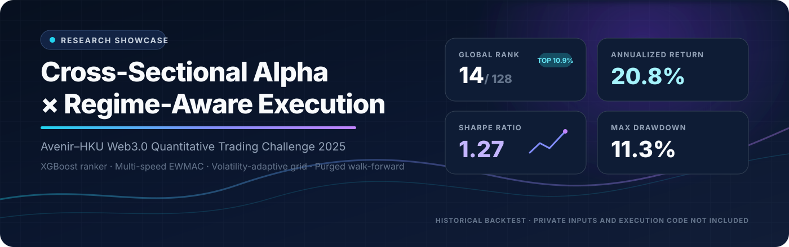
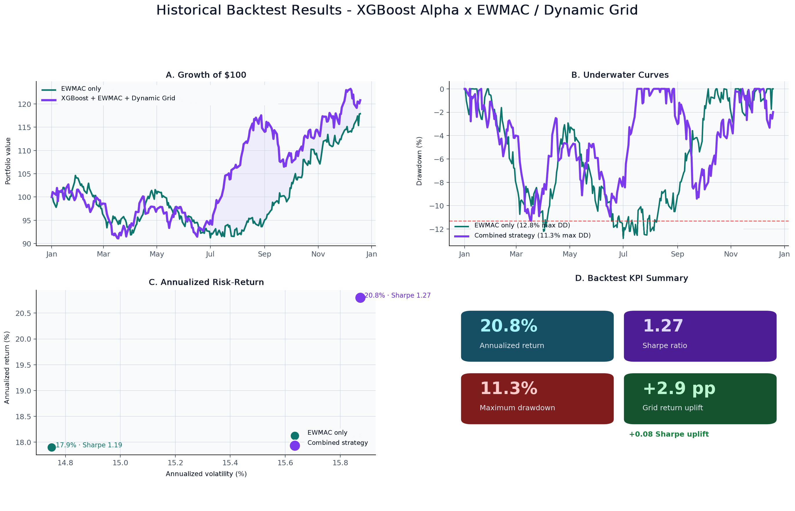
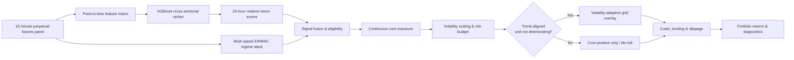

<div align="center">
  
</div>

<p align="center">
  <a href="https://www.kaggle.com/competitions/avenir-hku-web"></a>
  
  
  
  
  <a href="../../actions/workflows/public-surface.yml"></a>
</p>

<p align="center">
  <strong>Cross-sectional alpha research meets a regime-aware trend core and a volatility-adaptive grid overlay.</strong><br/>
  Real XGBoost research code, a confidential execution boundary, and author-reported historical backtest results.
</p>

> [!IMPORTANT]
> The XGBoost feature, label, metric, and purged walk-forward code is real and executable with authorized competition data. The EWMAC / Dynamic Grid execution strategy and the underlying return series remain private. The performance visualization below reports the author's **historical backtest results**; it cannot be independently reproduced from this public repository alone.

## At a glance

| Result | Value | Scope |
|:--|--:|:--|
| Global rank | **14 / 128** · top **10.9%** | Author-supplied competition result |
| Annualized return | **20.8%** | Author-reported private historical backtest |
| Sharpe ratio | **1.27** | Author-reported private historical backtest |
| Maximum drawdown | **11.3%** | Author-reported private historical backtest |
| Dynamic-grid uplift | **+2.9 pp** annualized return | Historical ablation versus EWMAC-only |
| Risk-adjusted uplift | **+0.08** Sharpe | Historical ablation versus EWMAC-only |

<div align="center">
  
</div>

<p align="center"><strong>Disclosure:</strong> the plotted paths and summary statistics are author-reported outputs from the private historical backtest. The underlying return series, trade ledger, and confidential strategy engine are not published here.</p>

## Research thesis

The system separates two jobs that are often mixed together:

1. **Rank future relative returns.** An XGBoost model scores the cross-section of crypto perpetual futures over a 24-hour horizon. The objective is aligned with the competition's tail-weighted Spearman evaluation rather than point-forecast error.
2. **Convert forecasts into controlled exposure.** A multi-speed EWMAC trend stack forms the continuous core position; a volatility-adaptive grid selectively harvests short-horizon pullbacks when the broader trend remains coherent.

The design is deliberately modular: predictive edge, portfolio construction, overlay logic, and execution frictions are evaluated as separate layers.

## Strategy architecture



### 1 · Cross-sectional alpha

- **Universe:** up to 355 crypto perpetual-futures contracts at 15-minute frequency.
- **Feature families:** momentum, volatility, liquidity, and technical-state variables.
- **Prediction target:** 24-hour forward cross-sectional return ordering.
- **Learner:** gradient-boosted decision trees optimized for ranking quality in the distribution tails.
- **Validation:** expanding purged walk-forward folds with a 96-bar gap for a 24-hour label on 15-minute bars.

The disclosed, leakage-aware reconstruction includes eight causal features: 1-day and 7-day momentum, 7-day realized volatility, 7-day log amount, RSI, normalized MACD, Bollinger z-score, and Amihud illiquidity. It also publishes the 24-hour VWAP target, tail-weighted Spearman metric, and historical XGBoost configuration. The original competition notebooks and fitted artifacts are not included.

These modules were migrated from the audited `src/avenir_quant` research package in the private repository and adapted only for the public package namespace and command-line entry point.

### 2 · Leakage-aware validation

The research loop uses **purged walk-forward evaluation**. Overlapping observations around the 24-hour label horizon are removed from the effective training boundary, and all dynamic choices are fitted using the training slice only. This keeps model selection and evaluation on opposite sides of the evidence boundary.

```text
time  ─────────────────────────────────────────────────────────────────────▶

fold 1  [ training window ] [ purge ] [ validation ]
fold 2          [ training window ] [ purge ] [ validation ]
fold 3                  [ training window ] [ purge ] [ validation ]
```

### 3 · Multi-speed trend core

Three EWMAC horizons—**8/32**, **16/64**, and **32/128**—summarize trend persistence at different speeds. Their normalized agreement maps into a continuous core exposure rather than a binary long/flat switch. Portfolio risk is then controlled with volatility scaling.

### 4 · Dynamic-grid overlay

The grid is an overlay, not an independent averaging-down strategy. It is eligible only when multi-horizon trend direction is aligned and trend quality has not materially deteriorated. Grid spacing and participation adapt to volatility, seeking to capture short-lived pullbacks and price repair inside a broader trend.

In the private historical ablation, the dynamic-grid layer adds **+2.9 percentage points** of annualized return and **+0.08 Sharpe** relative to the EWMAC-only core. The private return series and implementation required to reproduce that comparison are not included in this repository.

### 5 · Risk and implementation realism

The private engine models the frictions that can dominate high-turnover crypto strategies:

- volatility-scaled gross exposure;
- contract eligibility and liquidity controls;
- funding, exchange fees, and slippage;
- position and portfolio risk limits;
- fold-level stability and ablation diagnostics.

Venue-specific coefficients, order placement rules, leverage limits, and operational safeguards remain private.

## Public evidence boundary

| Published here | Intentionally withheld |
|:--|:--|
| Causal XGBoost features and 24-hour VWAP label | Raw and processed competition data |
| Tail-weighted Spearman and purged walk-forward code | Historical notebooks and trained artifacts |
| Executable XGBoost training/prediction entry point | Position-sizing and grid-trigger equations |
| Author-reported historical backtest visualization | Underlying return series, trade ledger, and private backtest engine |
| Typed confidential-strategy boundary | Venue-specific parameters and production infrastructure |
| Limitations and disclosure notes | Credentials, endpoints, and venue configuration |

[`src/public_framework`](src/public_framework) contains the disclosed XGBoost research track. Proprietary allocation and execution functions stop at an explicit exception, so this package cannot regenerate the historical backtest chart or recreate the confidential trading strategy.

## Repository map

```text
.
├── assets/
│   ├── hero.svg                     # README cover
│   └── historical-backtest-results.png # Author-reported private backtest summary
├── docs/
│   ├── METHODOLOGY.md               # Research protocol and design rationale
│   └── RESULTS_AND_DISCLOSURE.md    # Scope, provenance, and limitations
├── src/public_framework/
│   ├── __init__.py
│   ├── contracts.py                 # Public component interfaces
│   ├── data.py                      # Competition parquet loading
│   ├── features.py                  # Causal factors and 24-hour label
│   ├── metrics.py                   # Tail-weighted Spearman
│   ├── validation.py                # Purged walk-forward splits
│   ├── xgboost_alpha.py             # Real XGBoost OOS training loop
│   └── pipeline.py                  # Confidential strategy boundary
├── scripts/
│   └── train_xgboost_ranker.py      # Public training entry point
├── tests/
│   ├── test_public_boundary.py
│   └── test_xgboost_public_code.py
├── .gitignore
├── LICENSE
├── pyproject.toml
└── README.md
```

## Run the disclosed XGBoost research

```bash
python -m pip install -e ".[model]"
python scripts/train_xgboost_ranker.py /path/to/authorized/parquet/data \
  --output artifacts/xgboost_oos_predictions.csv
```

The command builds point-in-time features, creates the 24-hour target, fits expanding XGBoost folds, purges the label-overlap boundary, and writes out-of-sample predictions plus fold diagnostics. Competition data is not redistributed.

The confidential trading boundary remains explicit:

```python
from public_framework import ResearchPipeline, StrategyNotIncludedError

pipeline = ResearchPipeline.from_public_spec(
    horizon="24h",
    bar_frequency="15min",
    validation="purged-walk-forward",
)

try:
    pipeline.build_target_weights(market_panel=None)
except StrategyNotIncludedError:
    print("Portfolio sizing, the grid overlay, and execution remain private.")
```

There is no downloadable fitted model, private parameter file, or executable EWMAC/Grid strategy hidden elsewhere in the repository.

## Results & disclosure

The repository deliberately separates the public implementation from results produced inside the private research boundary:

- **Rank 14/128** is the competition result supplied by the author.
- **20.8% annualized return, 1.27 Sharpe, and 11.3% maximum drawdown** are author-reported results from the private historical backtest.
- **17.9% annualized return and 1.19 Sharpe** are the corresponding author-reported EWMAC-only ablation results.
- The displayed paths summarize that private backtest, but the underlying return series, transaction record, and strategy implementation are withheld and therefore cannot be independently reproduced from this repository.
- Past or simulated performance does not predict future results. Crypto perpetual futures carry leverage, liquidity, funding, model, and venue risks, including the risk of total loss.

For methodology detail and interpretation limits, read [Methodology](docs/METHODOLOGY.md) and [Results & Disclosure](docs/RESULTS_AND_DISCLOSURE.md).

## Competition context

The [Avenir–HKU Web3.0 Quantitative Trading Challenge 2025](https://avenirx.com/trading-challenge) was jointly organized by Avenir Group and HKU Business School. Its first round evaluated cross-sectional crypto return rankings using a weighted Spearman correlation; later rounds emphasized risk-adjusted trading performance and strategy defense.

## Citation

If you reference this public research summary, please cite the repository rather than treating it as a reproducible benchmark:

```bibtex
@misc{smartR168_avenir_hku_2025,
  author       = {SmartR168},
  title        = {Cross-Sectional Alpha with Regime-Aware EWMAC and Dynamic Grid},
  year         = {2025},
  howpublished = {Public research showcase for the Avenir--HKU Web3.0 Quantitative Trading Challenge}
}
```

---

<p align="center">
  <sub>Research showcase only · Strategy implementation confidential · No investment advice</sub>
</p>
